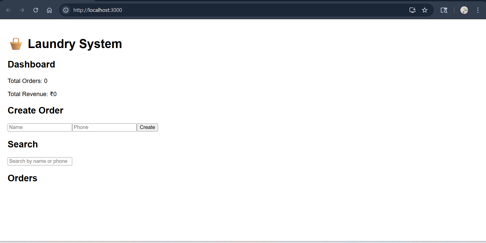
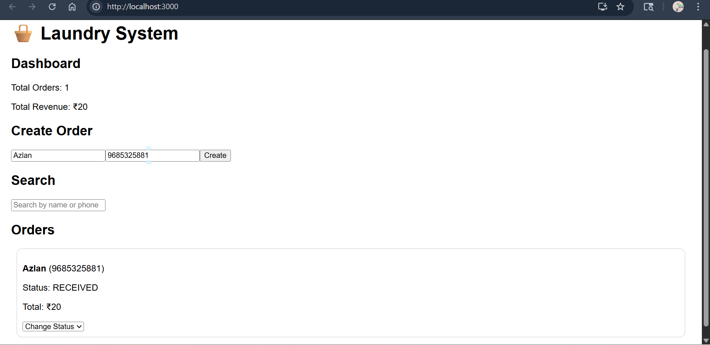
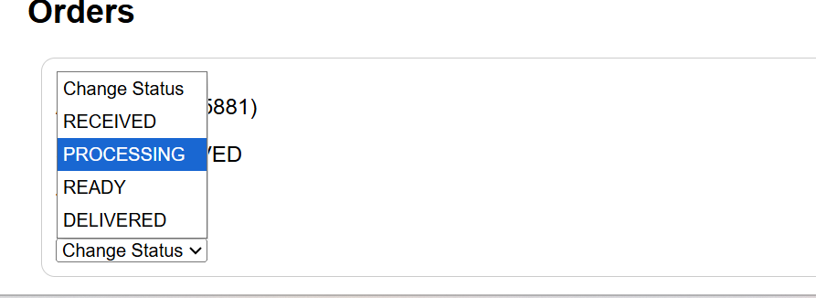
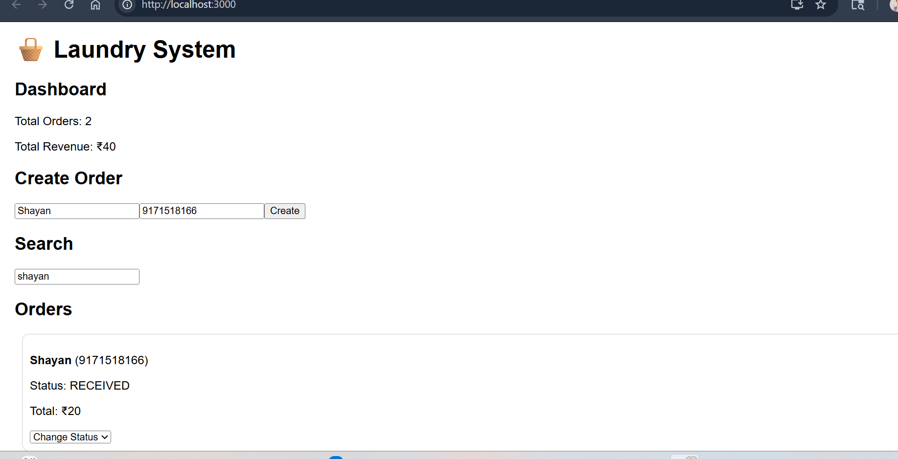

# 🧺 Mini Laundry Order Management System

🔗 GitHub Repository: https://github.com/Azlan-Ul-Haque-git/Laundary-project-system

## 📌 Overview

This is a lightweight laundry order management system built using an AI-first approach.
It allows dry cleaning businesses to manage orders, track status, and monitor basic analytics.
This system demonstrates real-world order management workflows including creation, status tracking, filtering, and analytics using a full-stack approach.

---

## 💡 Why This Project

This project simulates a real-world laundry business workflow, focusing on speed, simplicity, and practical usability rather than over-engineering.

---

## ▶️ How to Use

1. Enter customer name and phone number  
2. Click **Create Order**  
3. View order in list below  
4. Update status using dropdown  
5. Use search to find specific orders  
6. Check dashboard for analytics  

---

## 🚀 Features

### ✅ Order Management

* Create new orders
* Auto-generate unique order ID
* Calculate total bill automatically

### ✅ Status Tracking

* Update order status:

  * RECEIVED
  * PROCESSING
  * READY
  * DELIVERED

### ✅ Order Viewing

* View all orders
* Search by customer name or phone
* Filter by status

### ✅ Dashboard

* Total orders
* Total revenue
* Orders per status

---

## 🛠️ Tech Stack

* Frontend: React.js
* Backend: Node.js + Express
* Database: In-memory (for simplicity & speed)
* API Testing: Thunder Client

---

## ⚙️ Setup Instructions

### 🔹 Backend

```bash
cd server
npm install
node index.js
```

Runs on:

```
http://localhost:5000
```

---

### 🔹 Frontend

```bash
cd client
npm install
npm start
```

Runs on:

```
http://localhost:3000
```

---

## 📡 API Endpoints

| Method | Endpoint          | Description         |
| ------ | ----------------- | ------------------- |
| POST   | /api/orders       | Create order        |
| GET    | /api/orders       | Get all orders      |
| PUT    | /api/orders/:id   | Update order status |
| GET    | /api/orders/stats | Dashboard data      |

---

## 🤖 AI Usage Report (Important)

### Tools Used

* ChatGPT (for API structure, debugging, and UI logic)

---

### Sample Prompts

* "Build Express API for order management system"
* "Create React UI for CRUD operations"

---

### Where AI Helped

* Backend API structure
* Route handling
* Frontend basic UI

---

### What AI Got Wrong

* Initial structure lacked filtering
* No dashboard logic

---

### Improvements Made

* Added filtering & search
* Implemented dashboard API
* Improved UI and user experience

---

## ⚖️ Tradeoffs

* Used in-memory database (data resets on restart)
* Basic UI instead of complex design (focused on functionality)

---

## 🔮 Future Improvements

* Add authentication
* Use MongoDB for persistent storage
* Deploy full-stack app
* Improve UI with modern design

---

## 📷 Screenshots

### 🖥️ Dashboard & UI
Shows main interface with order creation and list view  


---

### 📦 Order Created
Demonstrates successful order creation  


---

### 🔄 Order Status Update
Shows status transition functionality  


---

### ⚙️ API Response
Backend API working via Thunder Client  


## 👨‍💻 Author

Azlan Ul Haque
